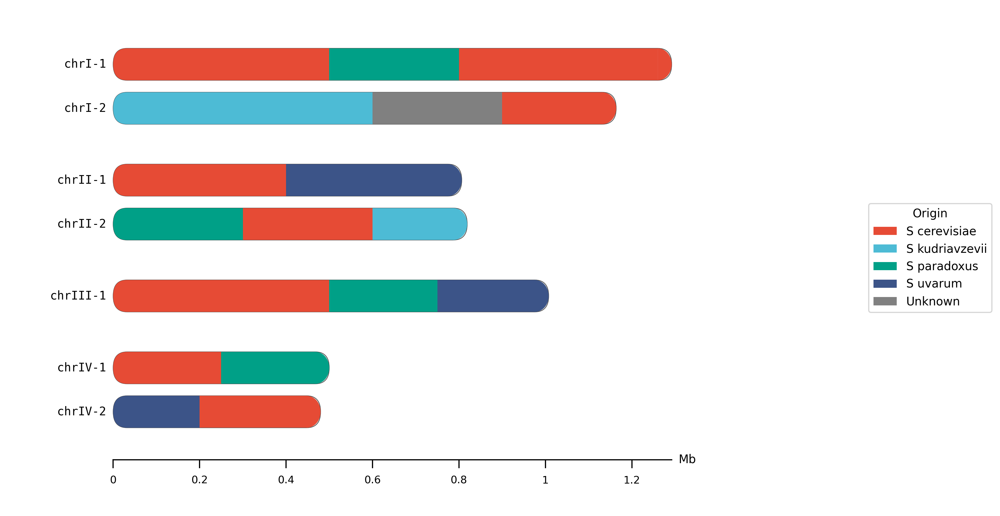
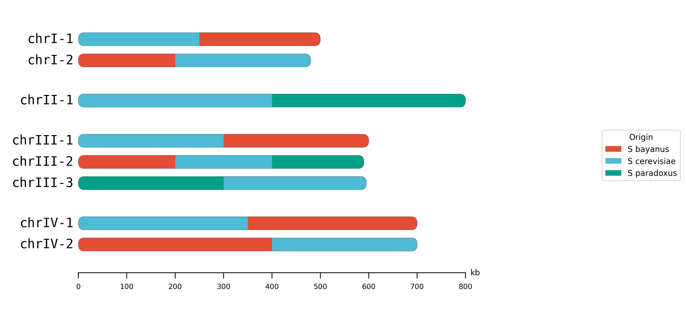
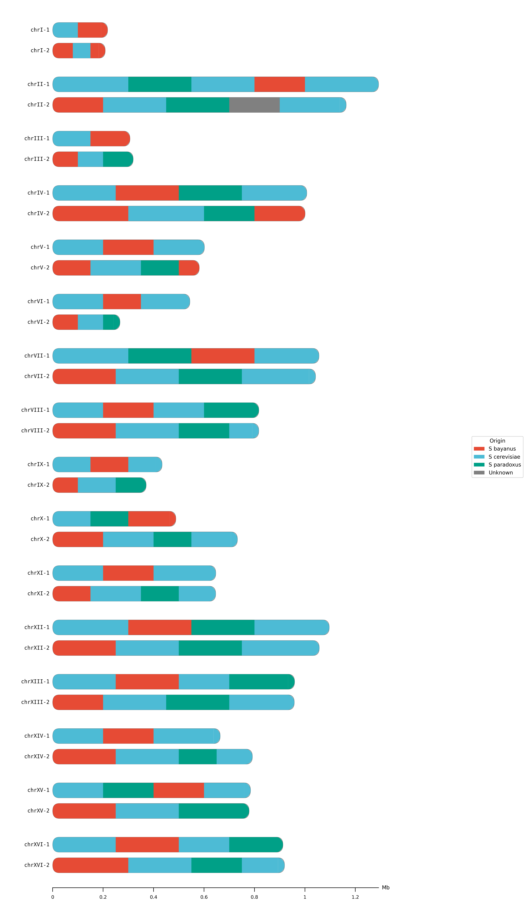
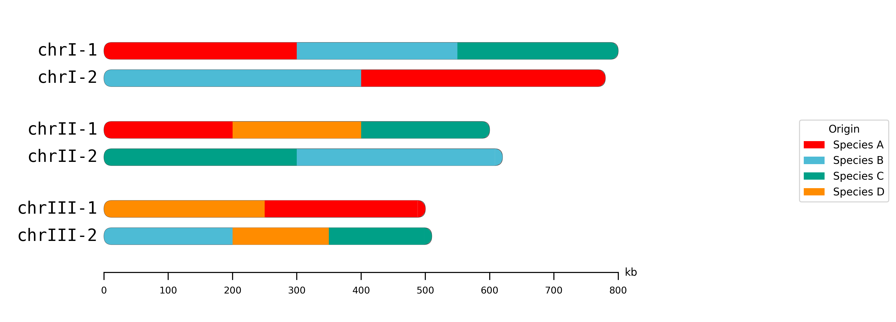
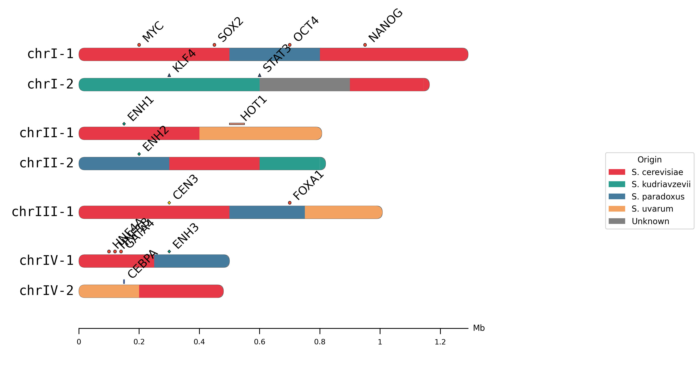

# HybridChromoMap

A tool for drawing chromosome ancestry painting diagrams for hybrid species.

**Version: 0.2.2**

**[Try the Web Version](https://johnnychen1113.github.io/hybridChromoMap/)** - No installation required!

## Citation

If you use HybridChromoMap in your research, please cite:

```
HybridChromoMap: A tool for chromosome ancestry painting visualization
https://github.com/JohnnyChen1113/hybridChromoMap
```

<!-- TODO: Add Zenodo DOI badge after enabling Zenodo integration -->

## Features

- Support for arbitrary species (user-defined chromosomes)
- Multiple origin coloring (not limited to 2 species, supports introgression)
- Variable ploidy support (haploid, diploid, aneuploid)
- Publication-quality output (SVG/PNG/PDF)
- Auto-generated colors when no color file is provided
- **Web version available** - use directly in browser, no installation needed

## Web Version

Try the online version at **https://johnnychen1113.github.io/hybridChromoMap/**

- No installation required
- Paste your data directly into the browser
- Export as SVG or PNG
- Works on any device with a modern browser

## Installation (Python CLI)

### Dependencies

- Python 3.8+
- matplotlib
- click

```bash
pip install matplotlib click
```

## Usage

```bash
# Basic usage (auto-generate colors)
python hybridchromomap.py -k karyotype.tsv -s segments.tsv -o output.png

# With custom colors
python hybridchromomap.py -k karyotype.tsv -s segments.tsv -c colors.tsv -o output.png

# Full options
python hybridchromomap.py \
    -k karyotype.tsv \
    -s segments.tsv \
    -c colors.tsv \
    -o output.svg \
    --sort length \
    --legend bottom \
    --width 14 \
    --dpi 300
```

### Options

| Option | Short | Description | Default |
|--------|-------|-------------|---------|
| `--karyotype` | `-k` | Karyotype definition file (TSV) | Required |
| `--segments` | `-s` | Segment origins file (TSV) | Required |
| `--colors` | `-c` | Origin colors file (TSV) | Auto-generate |
| `--annotations` | `-a` | Annotations file (TSV) | None |
| `--out` | `-o` | Output file path | out.png |
| `--sort` | | Sort order (none/name/length) | none |
| `--legend` | | Legend position (right/bottom/none) | right |
| `--no-scale` | | Hide scale bar | False |
| `--width` | | Figure width in inches | 12 |
| `--chrom-height` | | Chromosome bar height in inches | 0.24 |
| `--font-size` | | Label font size | 16 |
| `--dpi` | | PNG output resolution | 300 |
| `--marker-size` | | Annotation marker size in inches | 0.06 |
| `--label-angle` | | Annotation label rotation angle | 45 |
| `--no-labels` | | Hide annotation labels (show only markers) | False |

## Input File Formats

### Karyotype File (`karyotype.tsv`)

```tsv
#chrom	length	copy
chrI	500000	1
chrI	480000	2
chrII	800000	1
chrIII	600000	1
chrIII	590000	2
chrIII	595000	3
```

| Field | Type | Description |
|-------|------|-------------|
| chrom | string | Chromosome name |
| length | int | Length in bp |
| copy | int | Copy number (1, 2, 3...) |

### Segments File (`segments.tsv`)

```tsv
#chrom	copy	start	end	origin
chrI	1	0	250000	S_cerevisiae
chrI	1	250000	500000	S_paradoxus
chrI	2	0	200000	S_paradoxus
chrI	2	200000	480000	S_cerevisiae
```

| Field | Type | Description |
|-------|------|-------------|
| chrom | string | Chromosome name |
| copy | int | Copy number |
| start | int | Segment start position (bp) |
| end | int | Segment end position (bp) |
| origin | string | Origin identifier |

### Colors File (`colors.tsv`) - Optional

```tsv
#origin	color	label
species_A	red	Species A
species_B	#4DBBD5	Species B
species_C	(0, 160, 135)	Species C
species_D	darkorange	Species D
```

| Field | Type | Description |
|-------|------|-------------|
| origin | string | Origin identifier (matches segments file) |
| color | string | Color specification (see below) |
| label | string | Display label for legend |

**Supported color formats:**
- **Hex**: `#E64B35`, `#RGB` (short form)
- **RGB tuple**: `(230, 75, 53)` or `230,75,53`
- **Color names**: `red`, `blue`, `green`, `darkorange`, etc. (matplotlib named colors)

**Note:** If no colors file is provided, colors are auto-generated based on unique origins in the segments file.

### Annotations File (`annotations.tsv`) - Optional

```tsv
#chrom	copy	start	end	type	color	shape	label
chrI	1	125000	125000	TF	#E64B35	circle	MYC
chrI	1	550000	580000	hotspot	#F39B7F	rect	HOT1
chrII	1	200000	200000	centromere	gold	diamond	CEN
```

| Field | Type | Required | Description |
|-------|------|----------|-------------|
| chrom | string | Yes | Chromosome name |
| copy | int | Yes | Copy number |
| start | int | Yes | Start position (bp) |
| end | int | Yes | End position (bp), same as start for point markers |
| type | string | Yes | Annotation type (for auto-coloring) |
| color | string | No | Color (auto-assigned by type if omitted) |
| shape | string | No | Shape: `circle`, `triangle`, `diamond`, `rect`, `line` (default: circle) |
| label | string | No | Text label to display next to marker |

**Features:**
- **Jitter**: Overlapping markers are automatically staggered vertically
- **Auto-spacing**: Chromosomes with annotations get extra vertical space
- **Auto-coloring**: Colors are auto-assigned by type if not specified

## Examples

### Example 1: Basic Usage

A simple example with 4 chromosomes showing ancestry from multiple yeast species.

```bash
cd examples/example1_basic
python ../../hybridchromomap.py -k karyotype.tsv -s segments.tsv -c colors.tsv -o output.png
```



### Example 2: Aneuploidy

Demonstrates variable ploidy: diploid (chrI, chrIV), haploid (chrII), and triploid (chrIII).

```bash
cd examples/example2_aneuploidy
python ../../hybridchromomap.py -k karyotype.tsv -s segments.tsv -o output.png
```



### Example 3: S. bayanus Genome

Full 16-chromosome yeast genome with simulated ancestry painting.

```bash
cd examples/example3_sbay
python ../../hybridchromomap.py -k karyotype.tsv -s segments.tsv -o output.png --width 14
```



### Example 4: Custom Colors

Demonstrates multiple color formats: color names (`red`, `darkorange`), hex (`#4DBBD5`), and RGB tuples (`(0, 160, 135)`).

```bash
cd examples/example4_custom_colors
python ../../hybridchromomap.py -k karyotype.tsv -s segments.tsv -c colors.tsv -o output.png
```



### Example 5: Annotations

Demonstrates annotation markers (TF binding sites, enhancers, centromeres) with different shapes and automatic jitter for overlapping markers.

**With labels:**
```bash
cd examples/example5_annotations
python ../../hybridchromomap.py -k karyotype.tsv -s segments.tsv -c colors.tsv -a annotations.tsv -o output_with_labels.png
```



**Without labels (markers only):**
```bash
python ../../hybridchromomap.py -k karyotype.tsv -s segments.tsv -c colors.tsv -a annotations.tsv -o output.png --no-labels
```


## Output Formats

Output format is determined by file extension:
- `.svg` - Vector graphics (editable)
- `.png` - Raster graphics (high resolution)
- `.pdf` - Vector graphics (publication-ready)

## Changelog

### v0.2.2
- Add Citation section to README
- Regenerate all example outputs with new defaults
- Add run.sh scripts to each example for one-click execution

### v0.2.1
- Add `--no-labels` option to hide annotation labels
- Change default chromosome height to 0.24 inches (was 0.4)
- Change default font size to 16 (was 10)

### v0.1.5
- Add annotation markers feature (`-a` option)
- Support 5 marker shapes: circle, triangle, diamond, rect, line
- Automatic jitter for overlapping markers
- Dynamic spacing for chromosomes with annotations
- Add example5_annotations

### v0.1.4
- Fix bottom legend position (now displays below x-axis like CLI)
- Add italic option for species names in legend
- Add PDF export and custom filename support
- Add help documentation for data formats
- Add ZLin Lab website link

### v0.1.3
- Add web version (GitHub Pages) - no installation required
- JavaScript implementation with SVG/PNG export

### v0.1.2
- Add `--chrom-height` option to control chromosome bar height
- Add `--font-size` option to control label font size

### v0.1.1
- Add flexible color format support (hex, RGB tuple, color names)
- Add example4_custom_colors demo

### v0.1.0
- Initial release
- Support for arbitrary species with user-defined chromosomes
- Multiple origin coloring (supports introgression)
- Variable ploidy support (haploid, diploid, aneuploid)
- Publication-quality output (SVG/PNG/PDF)
- Auto-generated colors when no color file is provided

## License

MIT License

## Acknowledgments

Inspired by chromosome painting visualizations in hybrid species genomics research.

- [GeMo](https://github.com/Haoran-Jie/GeMo_Genomic_Mosaic_Visualization) - Genomic Mosaic Visualization tool
- [chromoMap](https://cran.r-project.org/web/packages/chromoMap/index.html) - Interactive visualization of chromosomes in R
